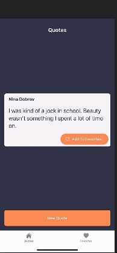
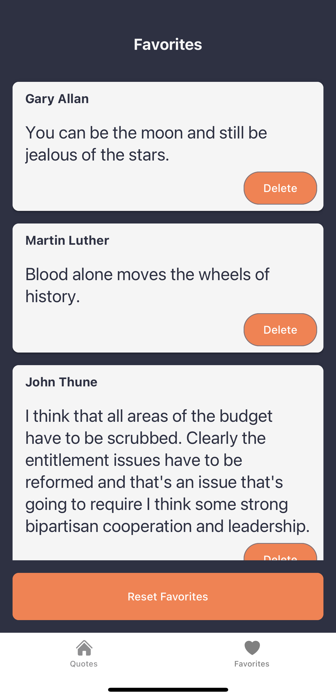

# Quotes and Favorites App

A React Native + Expo application that allows users to fetch random quotes, mark them as favorites, and manage them locally using AsyncStorage. The app features a clean, minimalist interface with a dark theme, built using React Native Paper and React Navigation.

## Table of Contents
1. [Overview](#overview)
2. [Video Demo](#demo)
3. [Screenshots](#screenshots)
4. [Features](#features)
5. [Installation](#installation)
6. [Usage](#usage)
7. [Technologies Used](#technologies-used)
8. [Contributing](#contributing)

## Overview

**Quotes and Favorites App** is designed to provide users with inspirational quotes fetched from an external API. Users can add their favorite quotes to a local list, view them, and manage their favorites efficiently. The app emphasizes a smooth and visually appealing user experience with a focus on simplicity and functionality.

## Demo



## Screenshots

<p float="left">
  
  
</p>

## Features

- **Random Quote Fetching**: Retrieve random quotes from an external API.
- **Favorites Management**: Add quotes to favorites, view the list of favorite quotes, delete individual quotes, or reset the entire favorites list.
- **Local Storage**: Persist favorite quotes using AsyncStorage to ensure data is retained between app sessions.
- **Tab Navigation**: Seamless navigation between Quotes and Favorites screens using React Navigation.
- **Responsive Design**: Adaptable layout for different device sizes with a minimalist-themed UI.

## Installation

1. **Clone the repository**:
    ```bash
    git clone https://github.com/syedramim/QuoteApp.git
    cd QuoteApp
    ```

2. **Install dependencies**:
    ```bash
    npm install
    ```
    or
    ```bash
    yarn
    ```

3. **Set up environment variables**:
    - Create a `.env` file in the root directory.
    - Define the following variables:
      ```
      EXPO_PUBLIC_BASE_URL=your_api_base_url
      EXPO_PUBLIC_API_KEY=your_api_key
      ```

4. **Start the development server**:
    ```bash
    npx expo start
    ```
    or
    ```bash
    yarn start
    ```

5. **Run on a device or emulator**:
    - For iOS: Press **i** in the terminal (requires Xcode installed).
    - For Android: Press **a** in the terminal (requires Android SDK installed).

## Usage

### Quotes Screen
1. **View a Quote**: On launch, the app fetches and displays a random quote.
2. **Add to Favorites**: Tap the **Add To Favorites** button to save the quote locally.
3. **Fetch New Quote**: Tap the **New Quote** button to retrieve another random quote.

### Favorites Screen
1. **View Favorites**: Displays a list of all saved favorite quotes.
2. **Delete a Quote**: Tap the **Delete** button on a quote card to remove it from favorites.
3. **Reset Favorites**: Tap the **Reset Favorites** button to clear all saved quotes.


## Technologies Used

- **React Native**: Framework for building native apps using React.
- **Expo**: Platform for making React Native development easier.
- **React Navigation**: Routing and navigation for React Native apps.
- **React Native Paper**: UI component library for React Native.
- **AsyncStorage**: Persistent key-value storage for React Native.
- **Axios**: Promise-based HTTP client for making API requests.

## Contributing

Contributions are welcome! Please fork the repository and submit a pull request for any enhancements or bug fixes.

1. Fork the repository.
2. Create a new branch: `git checkout -b feature/YourFeature`.
3. Commit your changes: `git commit -m 'Add some feature'`.
4. Push to the branch: `git push origin feature/YourFeature`.
5. Open a pull request.

